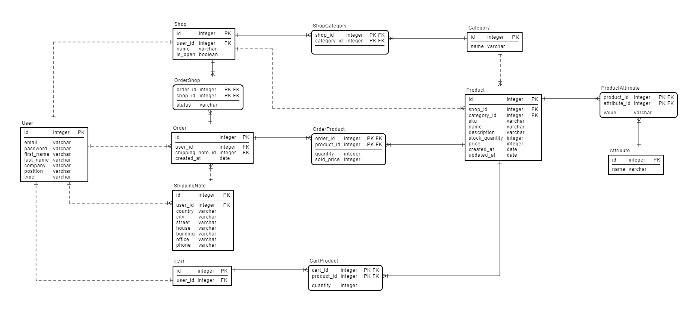

## 1. FASTRetail  
FASTRetail - REST API сервис для автоматизации оптовых закупок B2B пользователей.  

### 1.1. Настройка и запуск
В данный момент сервис находится в стадии разработки, в настройках проекта включен режим отладки. Для запуска необходимо:

 1. Клонировать данный репозиторий `git clone https://github.com/alzex3/fastr`
 2. Перейти в директорию с проектом и смонтировать контейнеры `docker compose up` 
 3. Создать аккаунт администратора `docker exec -it "django_container_id" python manage.py createsuperuser`
 4. Зайти в панель администратора и создать категории товаров в разделе Category.
 5. Сервис готов к работе!

  
## 2. Описание сервиса  
Сервис предоставляет платформу для взаимодействия поставщиков (далее - продавец) и заказчиков (далее - покупатель) товаров, а также обеспечивает функционал создания, обработки и ведения заказов.    
  

### 2.1. Типы аккаунтов пользователей  
Сервис предусматривает три типа аккаунта пользователей: продавец, покупатель и администратор.  

 - Продавец создаёт магазин и товары, принимает заказы.  
  
 - Покупатель просматривает имеющиеся в продаже товары от различных магазинов, формирует корзину товаров и создаёт заказ.   
    
 - Администратор создаёт категории реализуемых товаров и управляет     
   сайтом через панель администратора. Учётную запись администратора     
   можно создать только через консоль.  
   
> Тип аккаунта указывается при регистрации пользователя. Изменить тип аккаунта после регистрации нельзя.

### 2.2. Формат взаимодействия  
Взаимодействие пользователей с сервисом осуществляется посредством отправки HTTP запросов. Например, для просмотра корзины покупателю необходимо отправить следующий запрос:    
    
     GET http://127.0.0.1:8000/api/v1/buyer/cart/
     Content-Type: application/json
     Authorization: Bearer {{your_token}}
   
   
### 2.3. Регистрация  
Для регистрации аккаунта пользователь отправляет POST запрос, содержащий следующие данные:    
    
- Email (*используется в качестве логина*)  
- Пароль    
- Фамилия    
- Имя    
- Должность    
- Телефон    
- Компания    
- Тип аккаунта    
    
> По завершении регистрации на указанный email отправляется сообщение об успешной регистрации
   
   
### 2.4. Аутентификация  
Аутентификация и авторизация пользователей производится посредством валидации JWT-токена передаваемого в заголовке запроса.    
    
Для получения токена пользователю необходимо отправить POST запрос, содержащий логин и пароль в теле запроса.    
  
В ответ на запрос пользователю предоставляется два JWT-токена:  
  
 - Access-токен используется для авторизации при выполнении запросов. Время жизни access-токена - 1 день.   
     
 - Refresh-токен используется для получения новых access и refresh токенов взамен истекающих старых. Время жизни refresh-токена - 5 дней.   
  
  
### 2.5. Восстановление пароля  
Для восстановления пароля пользователю необходимо запросить письмо восстановления пароля на свой email. В полученном письме будет содержаться идентификатор и токен для подтверждения смены пароля.   
   
   
### 2.6. Функционал аккаунта  
- Редактирование данных профиля  
- Получение токена авторизации  
- Смена и восстановление пароля  
[Документация запросов в Postman / Account Endpoint](https://documenter.getpostman.com/view/19680142/Uyxkmky9)  
  
  
### 2.7. Функционал продавца  
- Создание и обновление карточки магазина  
- Создание собственных характеристик товаров  
- Создание и обновление реализуемых товаров    
- Включение и отключение приёма заказов  
- Просмотр и отслеживание полученных заказов  
- Изменение статусов заказов    
- Получение уведомлений о новых заказах на email  
[Документация запросов в Postman / Seller Endpoint](https://documenter.getpostman.com/view/19680142/UyxkmkyD)  
  
   
### 2.8. Функционал покупателя  
- Просмотр каталога, содержащего магазины всех продавцов  
- Просмотр каталога, содержащего товары всех магазинов  
- Поиск товаров по наименованию и описанию в каталоге товаров  
- Добавление в корзину товаров из различных магазинов  
- Создание заказа из позиций добавленных в корзину  
- Просмотр и отслеживание созданных заказов  
- Получение уведомлений об изменении статусов заказов на email  
  [Документация запросов в Postman / Buyer Endpoint](https://documenter.getpostman.com/view/19680142/UyxkmkyB)  
   
  
## 3. ER - Модель  
   
  
  
## 4. Стек технологий  
Production:  
- Python   
- Django + DRF  
- SimpleJWT  
- Postgres
- Docker
    
Development:   
- Mailhog  
  
  
## 5. Перспективы  
В следующих версиях планируется:  
  
 1. Добавить фильтрацию для каталога товаров и магазинов.  
 2. Добавить модель склада, автоматическую проверку и пересчёт остатков товара при создании заказов.  
 3. Настроить панель администратора.  
 4. Оптимизировать запросы к БД с помощью select_related и prefetch_related.
