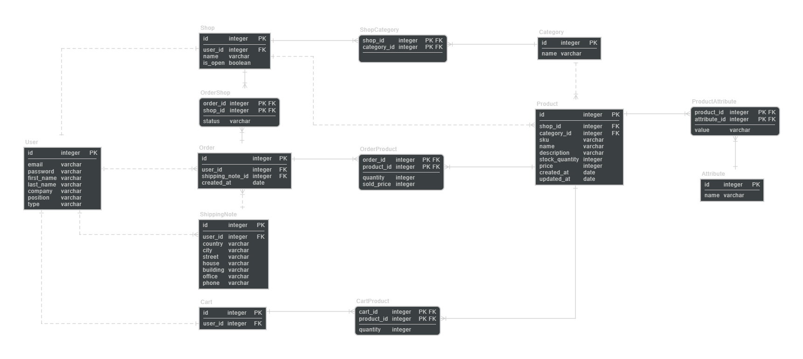

## 1. FASTR 
FASTR - A REST API service for automating wholesale B2B purchases.

### 1.1. Setup and Launch
The service is in development, with debug mode enabled in project settings. To launch, follow these steps:

 1. Clone the repository: `git clone https://github.com/alzex3/fastr`
 2. Navigate to the project directory and rename the file `.env.dist` to `.env`
 3. Mount containers with the command: `docker compose up`
 4. Run tests and check service functionality: `docker exec -it "django_container_id" pytest --cov`
 5. Create an administrator account: `docker exec -it "django_container_id" python manage.py createsuperuser`
 6. Access the administrator panel and create product categories in the Category section.
 7. The service is now ready for use!

 > The service is accessible at - [http://127.0.0.1:8000](http://127.0.0.1:8000). The Mailhog SMTP server interface is available at - [http://127.0.0.1:8025](http://127.0.0.1:8025).

## 2. Service Description  
The service provides a platform for interaction between suppliers (sellers) and customers (buyers) of goods, offering functionalities for creating, processing, and managing orders.

### 2.1. User Account Types  
The service offers three types of user accounts: seller, buyer, and administrator.

 - Sellers create stores and products, and accept orders.
 - Buyers browse store products, compile a shopping cart, and place orders.
 - Administrators create product categories and manage the site through the admin panel. Administrator accounts can only be created through the console.
   
> Account type is selected during user registration. It cannot be changed post-registration.

### 2.2. Interaction Format  
User interaction with the service is carried out through HTTP requests. For example, to view a cart, a buyer needs to send the following request:

     GET http://127.0.0.1:8000/api/v1/buyer/cart/
     Content-Type: application/json
     Authorization: Bearer {{your_token}}
   
### 2.3. Registration  
To register, a user sends a POST request with the following information:

- Email (*used as login*)
- Password
- Surname
- First Name
- Position
- Phone
- Company
- Account Type

> A registration confirmation email is sent to the provided email upon completion.

### 2.4. Authentication  
User authentication and authorization are performed by validating a JWT token provided in the request header.

To obtain a token, a user sends a POST request with login and password in the request body. The response includes two JWT tokens:

 - An Access token for authorization in subsequent requests, valid for 1 day.
 - A Refresh token to obtain new access and refresh tokens as the old ones expire, valid for 5 days.
  
### 2.5. Password Recovery  
For password recovery, users request a recovery email to their registered email address. The email contains an identifier and token to confirm the password change.
   
### 2.6. Account Functionality  
- Profile editing
- Authorization token retrieval
- Password change and recovery
[Request Documentation in Postman / Account](https://documenter.getpostman.com/view/19680142/Uyxkmky9)
  
### 2.7. Seller Functionality  
- Creating and updating store profiles
- Creating custom product characteristics
- Creating and updating products for sale
- Enabling and disabling order acceptance
- Viewing and tracking received orders
- Changing order statuses
- Receiving email notifications of new orders
[Request Documentation in Postman / Seller](https://documenter.getpostman.com/view/19680142/UyxkmkyD)
  
### 2.8. Buyer Functionality  
- Viewing catalogs containing seller stores
- Viewing catalogs containing store products
- Searching for products by name and description in the product catalog
- Adding products to the cart from stores
- Creating orders from items in the cart
- Viewing and tracking created orders
- Receiving email notifications about order status changes
  [Request Documentation in Postman / Buyer](https://documenter.getpostman.com/view/19680142/UyxkmkyB)
  
## 3. ER - Model  

## 4. OpenAPI
The service supports autogenerated OpenAPI schema. After launch, documentation is available at these addresses:
- openapi.yaml - [http://127.0.0.1:8000/api/schema/](http://127.0.0.1:8000/api/schema)
- Swagger UI - [http://127.0.0.1:8000/api/schema/swagger-ui](http://
- ReDoc - [http://127.0.0.1:8000/api/schema/redoc](http://127.0.0.1:8000/api/schema/redoc)

## 5. Tech Stack and Libraries
Production:
Python
- Django + DRF (Django Rest Framework)
- SimpleJWT
- Postgres
- Docker
- DRF-Spectacular
- Django-Environ
- Celery
- Redis

Development:
- Mailhog
- Pytest
- Coverage

## 6. Future Prospects
Planned for future versions:

1. Add social network authentication.
2. Implement filtering for product and store catalogs.
3. Introduce a warehouse model, automatic checking, and recalculation of product stocks when creating orders.
4. Configure the administrator panel.
5. Optimize database queries using select_related and prefetch_related.
